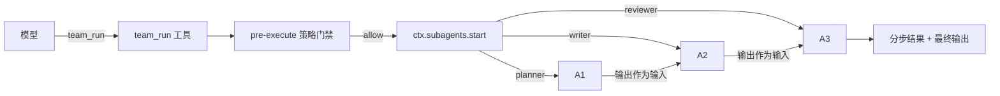

# dsh-agent-teams

> 多 Agent 编排插件：把 DeepSeek Harness 的子代理能力组装成「团队流水线」。
> Multi-agent orchestration for DeepSeek Harness: turn the `subagents` seam into reusable, policy-gated agent teams.

[](#license)  

## 这是什么 / What is this

`dsh-agent-teams` 是一个遵循 Harness「一切皆插件」理念的编排插件。它不重新发明 Agent 循环，
而是组合已有的插件化能力点：

- **工具（tools）**：注册 `team_list` / `team_run` / `team_delegate` 三个模型可见工具。
- **子代理（subagents）**：通过 `ctx.subagents.start()` 在 `spawn` / `fork` / `acp` 等 provider 上派生子代理。
- **策略（policy）**：用 `tools/pre-execute` 瀑布事件做并发门禁，超过上限的团队调用直接拒绝（fail loud）。

配置一个团队（如 planner → writer → reviewer），模型就能用一次 `team_run` 触发完整流水线：
每个角色的输出自动成为下一个角色的任务上下文。

## 特性 / Features

- **team_run** — 顺序执行整个团队；每步把上一步输出拼进下一步 prompt，返回分步结果与最终输出。
- **team_list** — 列出已配置的团队与角色，模型可先查询再调度。
- **team_delegate** — 把单个任务委托给任意已配置角色（找不到角色时按原始任务直派）。
- **并发门禁** — `maxConcurrentDelegations` 硬上限 + `tools/pre-execute` 预执行拒绝，防止并行调用打爆子代理 provider。
- **零循环代码** — 子代理的创建、取消、清理全部走 Harness 官方 `ctx.subagents` seam，随插随卸。

## 安装 / Install

```bash
# 从本地目录安装（会自动链接并写入 profile 的 bundles）
dsh plugin --profile <name> add /path/to/dsh-agent-teams

# 或从 npm/GitHub 安装
dsh plugin --profile <name> add dsh-agent-teams
```

需要 profile 已包含子代理服务与至少一个 provider：

```text
@deepseek-ai/dsh-subagent
@deepseek-ai/dsh-subagent-spawn-in-process   # 提供 provider: spawn
@deepseek-ai/dsh-subagent-fork-in-process   # 提供 provider: fork
```

## 配置 / Configuration

编辑 profile 的 `cordis.patch.yml`（或插件自带的补丁层）：

```yaml
- insert:
    - id: dsh-agent-teams
      name: dsh-agent-teams
      config:
        provider: spawn            # 使用的子代理 provider
        maxConcurrentDelegations: 3
        teams:
          - name: writing
            agents:
              - role: planner
                prompt: 'Plan the task: outline goals, steps, and acceptance criteria.'
              - role: writer
                prompt: 'Write the full deliverable following the plan.'
              - role: reviewer
                prompt: 'Review the deliverable for correctness and quality; report issues.'
```

| 字段 | 类型 | 默认 | 说明 |
|---|---|---|---|
| `provider` | string | `spawn` | `ctx.subagents` 上注册的 provider 名 |
| `maxConcurrentDelegations` | number | `3` | 本插件并发派生的硬上限 |
| `teams` | array | `[]` | 团队列表：`name` + 有序 `agents[{role, prompt}]` |

## 用法 / Usage

给模型一句自然语言即可：

```text
Use team_run with team "writing" on: 为一间咖啡店写一句广告语。
```

插件会依次派生 planner / writer / reviewer 三个子代理，最后把整条流水线结果返回给模型。

## 架构 / How it works



- 工具实现只依赖 `ctx.tools`、`ctx.subagents` 两个服务（`inject: ['tools', 'subagents']`）。
- 每个子代理携带调用方 `exec.agent` 作为 parent，继承血缘、深度与取消信号（`exec.signal`）。
- `run.dispose()` 在结果收集后无条件执行，保证子代理侧剩余工作被取消并释放资源。

## 开发 / Development

```bash
npm install
npm run build   # tsc -> lib/
```

本地验证（使用复制出的 profile）：

```bash
cp -r ~/.dsh/profiles/headless ~/.dsh/profiles/teams-test
dsh plugin --profile teams-test add /path/to/dsh-agent-teams
dsh --profile teams-test --dump-config     # 确认补丁与配置生效
dsh --profile teams-test "用 team_run 跑 writing 团队：写一句咖啡店广告语"
```

## License

MIT